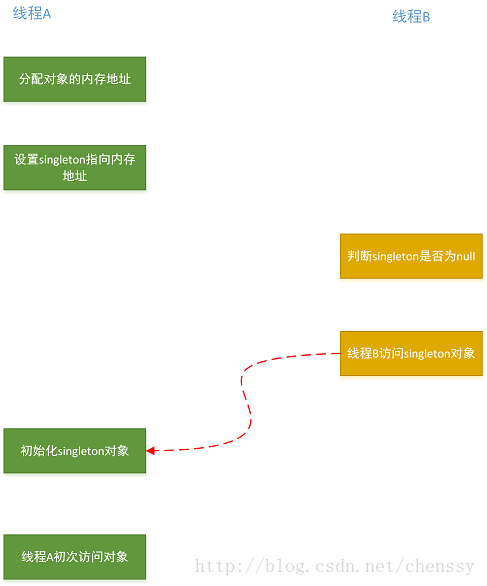

#### 一、概念
DCL，即Double Check Lock，中卫双重检查锁定
#### 二、问题分析
我们先看单例模式里面的懒汉式：
```java
public class Singleton {
   private static Singleton singleton;

   private Singleton(){}

   public static Singleton getInstance(){
       if(singleton == null){
           singleton = new Singleton();
       }

       return singleton;
   }
}
```
我们都知道这种写法是错误的，因为它无法保证线程的安全性。优化如下：
```java
public class Singleton {
   private static Singleton singleton;

   private Singleton(){}

   public static synchronized Singleton getInstance(){
       if(singleton == null){
           singleton = new Singleton();
       }

       return singleton;
   }
}
```
优化非常简单，就是在getInstance方法上面做了同步，但是synchronized就会导致这个方法比较低效，导致程序性能下降，那么怎么解决呢？聪明的人们想到了双重检查 DCL：
```java
public class Singleton {
   private static Singleton singleton;

   private Singleton(){}

   public static Singleton getInstance(){
       if(singleton == null){                              // 1
           synchronized (Singleton.class){                 // 2
               if(singleton == null){                      // 3
                   singleton = new Singleton();            // 4
               }
           }
       }
       return singleton;
   }
}
```
就如上面所示，这个代码看起来很完美，理由如下：

- 如果检查第一个singleton不为null,则不需要执行下面的加锁动作，极大提高了程序的性能；
- 如果第一个singleton为null,即使有多个线程同一时间判断，但是由于synchronized的存在，只会有一个线程能够创建对象；
- 当第一个获取锁的线程创建完成后singleton对象后，其他的在第二次判断singleton一定不会为null，则直接返回已经创建好的singleton对象；

通过上面的分析，DCL看起确实是非常完美，但是可以明确地告诉你，这个错误的。上面的逻辑确实是没有问题，分析也对，但是就是有问题，那么问题出在哪里呢？在回答这个问题之前，我们先来复习一下创建对象过程，实例化一个对象要分为三个步骤：

- 分配内存空间
- 初始化对象
- 将内存空间的地址赋值给对应的引用

但是由于重排序的缘故，步骤2、3可能会发生重排序，其过程如下：
- 分配内存空间
- 将内存空间的地址赋值给对应的引用
- 初始化对象

如果2、3发生了重排序就会导致第二个判断会出错，singleton != null，但是它其实仅仅只是一个地址而已，此时对象还没有被初始化，所以return的singleton对象是一个没有被初始化的对象，如下：


按照上面图例所示，线程B访问的是一个没有被初始化的singleton对象。
通过上面的阐述，我们可以判断DCL的错误根源在于步骤4：
```java
singleton = new Singleton();
```
知道问题根源所在，那么怎么解决呢？有两个解决办法：

- 不允许初始化阶段步骤2 、3发生重排序。
- 允许初始化阶段步骤2 、3发生重排序，但是不允许其他线程“看到”这个重排序。

#### 三、解决方案
##### 3.1 基于volatile解决方案
```java
public class Singleton {
   private volatile static Singleton singleton;

   private Singleton(){}

   public static Singleton getInstance(){
       if(singleton == null){                              // 1
           synchronized (Singleton.class){                 // 2
               if(singleton == null){                      // 3
                   singleton = new Singleton();            // 4
               }
           }
       }
       return singleton;
   }
}
```
当singleton声明为volatile后，步骤2、步骤3就不会被重排序了，也就可以解决上面那问题了
##### 3.2 基于类初始化的解决方案
该解决方案的根本就在于：利用classloder的机制来保证初始化instance时只有一个线程。JVM在类初始化阶段会获取一个锁，这个锁可以同步多个线程对同一个类的初始化
```java
public class Singleton {
   private static class SingletonHolder{
       public static Singleton singleton = new Singleton();
   }

   public static Singleton getInstance(){
       return SingletonHolder.singleton;
   }
}
```

