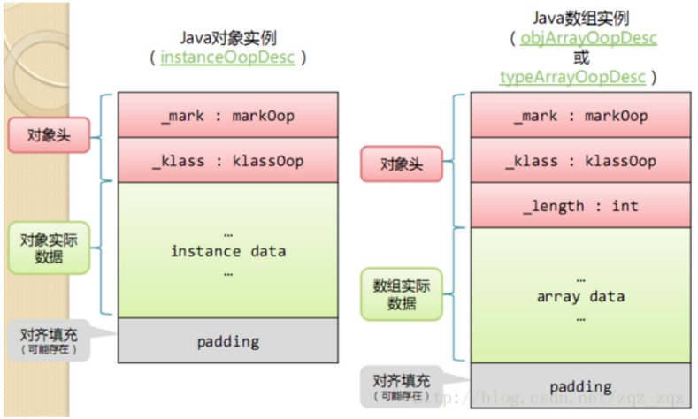

#### 一、实现原理
Java中每一个对象都可以作为锁，这是synchronized实现同步的基础：
- 普通同步方法，锁是当前的实例对象
- 静态同步方法,锁是当前类的class对象
- 同步方法块，锁是括号里面的对象

同步代码块使用monitorenter和monitorexit指令实现，同步方法使用方法修饰符ACC_SYNCHRONIZED实现

- 同步代码块：monitorenter指令插入到同步代码块的开始位置，monitorexit指令插入到同步代码的结束位置。
- 同步方法：synchronized方法则会被翻译成普通的方法调用和返回指令如:invokevirtual、areturn指令，在VM字节码层面并没有任何特别的指令来实现被synchronized修饰的方法，而是在Class文件的方法表中将该方法的access_flags字段中的synchronized标志位置1，表示该方法是同步方法并使用调用该方法的对象或该方法所属的Class在JVM的内部对象表示Klass做为锁对象

#### 二、java对象在内存大小
java对象在内存中占用的空间分为3类， 1. 对象头（Header）； 2. 实例数据（Instance Data）; 3. 对齐填充（Padding）

##### 2.1 对象头
java对象头主要包括两部分数据:Mark Word(标记字段)、Klass Pointer(类型指针)
- Mark Word:用于存储对象自身的运行时数据，如哈希码（HashCode）、GC分代年龄、锁状态标志、线程持有的锁、偏向线程ID、偏向时间戳等等，占用内存大小与虚拟机位长一致
- 类型指针指向对象的类元数据，虚拟机通过这个指针确定该对象是哪个类的实例
###### 对象头空间
1. 在32位系统下，存放Class指针的空间大小是4字节，MarkWord是4字节，对象头为8字节。
2. 在64位系统下，存放Class指针的空间大小是8字节，MarkWord是8字节，对象头为16字节。
3. 在64位开启指针压缩的情况下 -XX:+UseCompressedOops，存放Class指针的空间大小是4字节，MarkWord是8字节，对象头为12字节。
4. 如果对象是数组，那么额外增加4个字节
##### 2.2 数组长度
如果对象是一个数组, 那在对象头中还必须有一块数据用于记录数组长度，也就是一个int类型的对象，占4字节
##### 2.3 实例数据
实例数据部分是对象真正存储的有效信息，也是在程序代码中所定义的各种类型的字段内容。无论是从父类继承下来的，还是在子类中定义的，都需要记录起来
##### 2.4 对齐填充
最后一块对齐填充空间并不是必然存在的，也没有特别的含义，它仅仅起着占位符的作用。这是由于HotSpot VM的自动内存管理系统要求对象起始地址必须是8字节的整数倍，换句话说，就是对象的大小必须是8字节的整数倍
#### 三、monitor
- Owner：初始时为NULL表示当前没有任何线程拥有该monitor record，当线程成功拥有该锁后保存线程唯一标识，当锁被释放时又设置为NULL；
- EntryQ:关联一个系统互斥锁（semaphore），阻塞所有试图锁住monitor record失败的线程。
- RcThis:表示blocked或waiting在该monitor record上的所有线程的个数。
- Nest:用来实现重入锁的计数。
- HashCode:保存从对象头拷贝过来的HashCode值（可能还包含GC age）。
- Candidate:用来避免不必要的阻塞或等待线程唤醒，因为每一次只有一个线程能够成功拥有锁，如果每次前一个释放锁的线程唤醒所有正在阻塞或等待的线程，会引起不必要的上下文切换（从阻塞到就绪然后因为竞争锁失败又被阻塞）从而导致性能严重下降。Candidate只有两种可能的值0表示没有需要唤醒的线程1表示要唤醒一个继任线程来竞争锁
#### 四、锁优化
jdk1.6对锁的实现引入了大量的优化，如自旋锁、适应性自旋锁、锁消除、锁粗化、偏向锁、轻量级锁等技术来减少锁操作的开销。
锁主要存在四中状态，依次是：无锁状态、偏向锁状态、轻量级锁状态、重量级锁状态，他们会随着竞争的激烈而逐渐升级。注意锁可以升级不可降级，这种策略是为了提高获得锁和释放锁的效率
##### 4.1 自旋锁
线程的阻塞和唤醒需要CPU从用户态转为核心态，频繁的阻塞和唤醒对CPU来说是一件负担很重的工作，势必会给系统的并发性能带来很大的压力。同时我们发现在许多应用上面，对象锁的锁状态只会持续很短一段时间，为了这一段很短的时间频繁地阻塞和唤醒线程是非常不值得的。所以引入自旋锁。
何谓自旋锁？
所谓自旋锁，就是让该线程等待一段时间，不会被立即挂起，看持有锁的线程是否会很快释放锁。怎么等待呢？执行一段无意义的循环即可（自旋）。
##### 4.2 适应自旋锁
自适应自旋锁。所谓自适应就意味着自旋的次数不再是固定的，它是由前一次在同一个锁上的自旋时间及锁的拥有者的状态来决定。它怎么做呢？线程如果自旋成功了，那么下次自旋的次数会更加多，因为虚拟机认为既然上次成功了，那么此次自旋也很有可能会再次成功，那么它就会允许自旋等待持续的次数更多。反之，如果对于某个锁，很少有自旋能够成功的，那么在以后要或者这个锁的时候自旋的次数会减少甚至省略掉自旋过程，以免浪费处理器资源
##### 4.3 锁消除
JVM检测到不可能存在共享数据竞争，这是JVM会对这些同步锁进行锁消除。锁消除的依据是逃逸分析的数据支持
##### 4.4 锁粗化
将多个连续的加锁、解锁操作连接在一起，扩展成一个范围更大的锁
##### 4.5 楄向锁
在无多线程竞争的情况下尽量减少不必要的轻量级锁执行路径
- 获取锁
  检测Mark Word是否为可偏向状态，即是否为偏向锁1，锁标识位为01；
  - 若为可偏向状态，则测试线程ID是否为当前线程ID，如果是，则执行步骤（5），否则执行步骤（3）；
  - 如果线程ID不为当前线程ID，则通过CAS操作竞争锁，竞争成功，则将Mark Word的线程ID替换为当前线程ID，否则执行线程（4）；
  - 通过CAS竞争锁失败，证明当前存在多线程竞争情况，当到达全局安全点，获得偏向锁的线程被挂起，偏向锁升级为轻量级锁，然后被阻塞在安全点的线程继续往下执行同步代码块；
  - 执行同步代码块
- 释放锁:偏向锁的释放采用了一种只有竞争才会释放锁的机制，线程是不会主动去释放偏向锁，需要等待其他线程来竞争。偏向锁的撤销需要等待全局安全点（这个时间点是上没有正在执行的代码）。其步骤如下：
  - 暂停拥有偏向锁的线程，判断锁对象石是否还处于被锁定状态；
  - 撤销偏向苏，恢复到无锁状态（01）或者轻量级锁的状态；
##### 4.6 轻量级锁 
- 获取锁
  - 判断当前对象是否处于无锁状态（hashcode、0、01），若是，则JVM首先将在当前线程的栈帧中建立一个名为锁记录（Lock Record）的空间，用于存储锁对象目前的Mark Word的拷贝（官方把这份拷贝加了一个Displaced前缀，即Displaced Mark Word）；否则执行步骤（3）；
  - JVM利用CAS操作尝试将对象的Mark Word更新为指向Lock Record的指正，如果成功表示竞争到锁，则将锁标志位变成00（表示此对象处于轻量级锁状态），执行同步操作；如果失败则执行步骤（3）；
  - 判断当前对象的Mark Word是否指向当前线程的栈帧，如果是则表示当前线程已经持有当前对象的锁，则直接执行同步代码块；否则只能说明该锁对象已经被其他线程抢占了，这时轻量级锁需要膨胀为重量级锁，锁标志位变成10，后面等待的线程将会进入阻塞状态；
- 释放锁:轻量级锁的释放也是通过CAS操作来进行的，主要步骤如下：
  - 取出在获取轻量级锁保存在Displaced Mark Word中的数据；
  - 用CAS操作将取出的数据替换当前对象的Mark Word中，如果成功，则说明释放锁成功，否则执行（3）；
  - 如果CAS操作替换失败，说明有其他线程尝试获取该锁，则需要在释放锁的同时需要唤醒被挂起的线程。
##### 4.7 重量级锁 
重量级锁通过对象内部的监视器（monitor）实现，其中monitor的本质是依赖于底层操作系统的Mutex Lock实现，操作系统实现线程之间的切换需要从用户态到内核态的切换，切换成本非常高