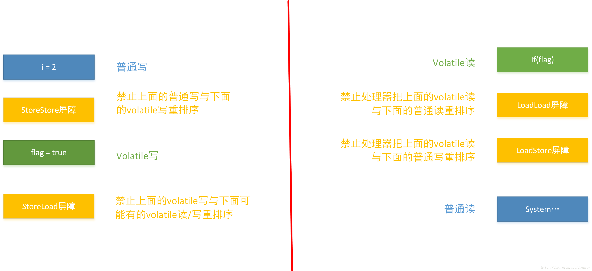
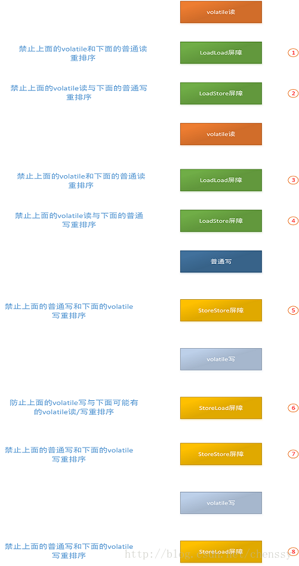
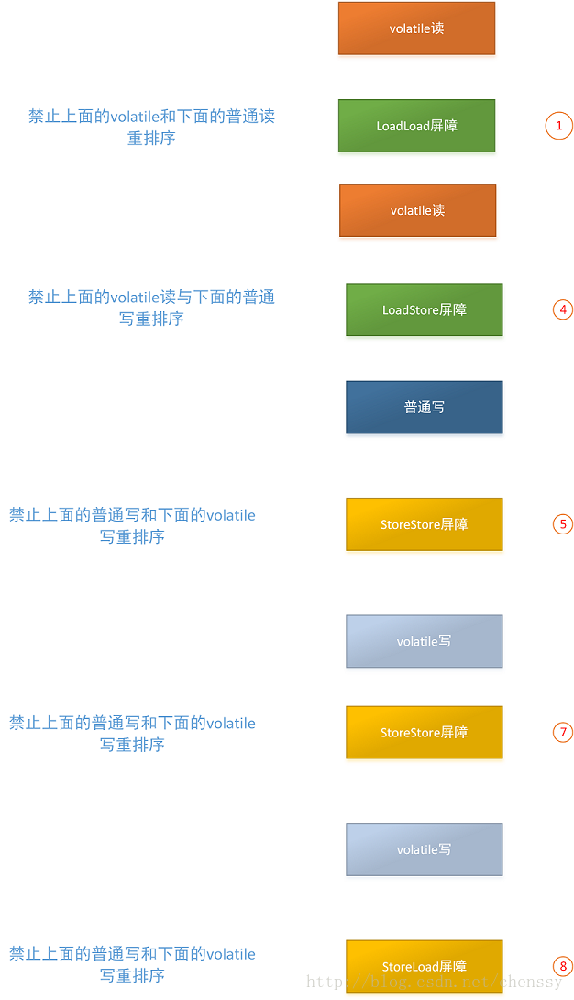

#### 一、特性
- volatile可见性：对一个volatile的读，总可以看到对这个变量最终的写;
volatile原子性；volatile对单个读/写具有原子性（32位Long、Double），但是复合操作除外，例如i++;
- volatile原子性；volatile对单个读/写具有原子性（32位Long、Double），但是复合操作除外，例如i++
#### 二、volataile的内存语义及其实现
volatile的写内存语义是直接刷新到主内存中，读的内存语义是直接从主内存中读取。
那么volatile的内存语义是如何实现的呢？对于一般的变量则会被重排序，而对于volatile则不能，这样会影响其内存语义，所以为了实现volatile的内存语义JMM会限制重排序。其重排序规则如下
- 如果第一个操作为volatile读，则不管第二个操作是啥，都不能重排序。这个操作确保volatile读之后的操作不会被编译器重排序到volatile读之前；
- 当第二个操作为volatile写是，则不管第一个操作是啥，都不能重排序。这个操作确保volatile写之前的操作不会被编译器重排序到volatile写之后；
- 当第一个操作volatile写，第二操作为volatile读时，不能重排序。

volatile的底层实现是通过插入内存屏障，但是对于编译器来说，发现一个最优布置来最小化插入内存屏障的总数几乎是不可能的，所以，JMM采用了保守策略。如下：
- 在每一个volatile写操作前面插入一个StoreStore屏障
- 在每一个volatile写操作后面插入一个StoreLoad屏障
- 在每一个volatile读操作后面插入一个LoadLoad屏障
- 在每一个volatile读操作后面插入一个LoadStore屏障

StoreStore屏障可以保证在volatile写之前，其前面的所有普通写操作都已经刷新到主内存中。
StoreLoad屏障的作用是避免volatile写与后面可能有的volatile读/写操作重排序。
LoadLoad屏障用来禁止处理器把上面的volatile读与下面的普通读重排序。
LoadStore屏障用来禁止处理器把上面的volatile读与下面的普通写重排序
```java
public class VolatileTest {
    int i = 0;
    volatile boolean flag = false;
    public void write(){
        i = 2;
        flag = true;
    }

    public void read(){
        if(flag){
            System.out.println("---i = " + i);
        }
    }
}
```



上面通过一个例子稍微演示了volatile指令的内存屏障图例。

volatile的内存屏障插入策略非常保守，其实在实际中，只要不改变volatile写-读得内存语义，编译器可以根据具体情况优化，省略不必要的屏障。如下:
```java
public class VolatileBarrierExample {
    int a = 0;
    volatile int v1 = 1;
    volatile int v2 = 2;

    void readAndWrite(){
        int i = v1;     //volatile读
        int j = v2;     //volatile读
        a = i + j;      //普通读
        v1 = i + 1;     //volatile写
        v2 = j * 2;     //volatile写
    }
}
```
没有优化的示例图如下：



我们来分析上图有哪些内存屏障指令是多余的
- 1：这个肯定要保留了
- 2：禁止下面所有的普通写与上面的volatile读重排序，但是由于存在第二个volatile读，那个普通的读根本无法越过第二个volatile读。所以可以省略。
- 3：下面已经不存在普通读了，可以省略。
- 4：保留
- 5：保留
- 6：下面跟着一个volatile写，所以可以省略
- 7：保留
- 8：保留
所以2、3、6可以省略，其示意图如下：



