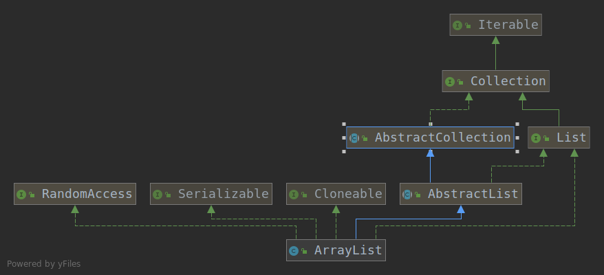

#### 一、类图

- ArrayList<E>：说明ArrayList支持泛型。
- extends AbstractList<E> ：继承了AbstractList。AbstractList提供List接口的骨干实现，以最大限度地减少“随机访问”数据存储（如ArrayList）实现Llist所需的工作。
- implements List<E>：实现了List。实现了所有可选列表操作
- implements RandomAccess：表明ArrayList支持快速（通常是固定时间）随机访问。此接口的主要目的是允许一般的算法更改其行为，从而在将其应用到随机或连续访问列表时能提供良好的性能
- implements Cloneable：表明其可以调用clone()方法来返回实例的field-for-field拷贝
- implements java.io.Serializable：表明该类具有序列化功能
#### 一、常用变量
```java
    /**
     * 初始容量为10
     */
    private static final int DEFAULT_CAPACITY = 10;

    /**
     * 指定该ArrayList容量为0时，返回该空数组
     */
    private static final Object[] EMPTY_ELEMENTDATA = {};

    /**
     * 当调用无参构造方法，返回的是该数组。刚创建一个ArrayList 时，其内数据量为0。
     * 它与EMPTY_ELEMENTDATA的区别就是：该数组是默认返回的，而后者是在用户指定容量为0时返回
     */
    private static final Object[] DEFAULTCAPACITY_EMPTY_ELEMENTDATA = {};

    /**
     * 保存添加到ArrayList中的元素。
     * ArrayList的容量就是该数组的长度。
     * 该值为DEFAULTCAPACITY_EMPTY_ELEMENTDATA 时，当第一次添加元素进入ArrayList中时，数组将扩容值DEFAULT_CAPACITY。
     * 被标记为transient，在对象被序列化的时候不会被序列化
     * ArrayList自定义了它的序列化和反序列化方式。详情请查看writeObject(java.io.ObjectOutputStream s)和readObject(java.io.ObjectOutputStream s)方法
     */
    transient Object[] elementData; // non-private to simplify nested class access

    /**
     * ArrayList的实际大小（数组包含的元素个数
     */
    private int size;
```
#### 二、构造方法
- 1、ArrayList(int initialCapacity)：构造一个指定容量为capacity的空ArrayList。
- 2、ArrayList()：构造一个初始容量为 10 的空列表。
- 3、ArrayList(Collection<? extends E> c)：构造一个包含指定 collection 的元素的列表，这些元素是按照该 collection 的迭代器返回它们的顺序排列的。
#### 三、常用方法
##### 3.1 add(E e)
- 1、空间检查，如果有需要进行扩容
- 2、插入元素
```java
    /**
     * 添加元素到list末尾.
     *
     * @param e element to be appended to this list
     * @return <tt>true</tt> (as specified by {@link Collection#add})
     */
    public boolean add(E e) {
        //确认list容量，如果不够，容量加1。注意：只加1，保证资源不被浪费
        ensureCapacityInternal(size + 1);  // Increments modCount!!
        elementData[size++] = e;
        return true;
    }
```
##### 3.2 扩容
- 1、进行空间检查，决定是否进行扩容，以及确定最少需要的容量
- 2、如果确定扩容，就执行grow(int minCapacity)，minCapacity为最少需要的容量
- 3、第一次扩容，逻辑为newCapacity = oldCapacity + (oldCapacity >> 1);即在原有的容量基础上增加一半。
- 4、第一次扩容后，如果容量还是小于minCapacity，就将容量扩充为minCapacity。
- 5、对扩容后的容量进行判断，如果大于允许的最大容量MAX_ARRAY_SIZE，则将容量再次调整为MAX_ARRAY_SIZE。至此扩容操作结束。
```java
    /**
     * 增加ArrayList容量。
     *
     * @param   minCapacity   想要的最小容量
     */
    public void ensureCapacity(int minCapacity) {
        // 如果elementData等于DEFAULTCAPACITY_EMPTY_ELEMENTDATA，最小扩容量为DEFAULT_CAPACITY，否则为0
        int minExpand = (elementData != DEFAULTCAPACITY_EMPTY_ELEMENTDATA)
            // any size if not default element table
            ? 0
            // larger than default for default empty table. It's already
            // supposed to be at default size.
            : DEFAULT_CAPACITY;
        //如果想要的最小容量大于最小扩容量，则使用想要的最小容量
        if (minCapacity > minExpand) {
            ensureExplicitCapacity(minCapacity);
        }
    }
 /**
     * 数组容量检查，不够时则进行扩容，只供类内部使用
     * @param minCapacity 想要的最小容量
     */
    private void ensureExplicitCapacity(int minCapacity) {
        modCount++;

        //确保指定的最小容量 > 数组缓冲区当前的长度
        if (minCapacity - elementData.length > 0)
            //扩容
            grow(minCapacity);
    }

    /**
     * 分派给arrays的最大容量为什么要减去8呢？
     * 因为某些VM会在数组中保留一些头字，尝试分配这个最大存储容量，可能会导致array容量大于VM的limit，最终导致OutOfMemoryError。
     */
    private static final int MAX_ARRAY_SIZE = Integer.MAX_VALUE - 8;

    /**
     * 扩容，保证ArrayList至少能存储minCapacity个元素
     * 第一次扩容，逻辑为newCapacity = oldCapacity + (oldCapacity >> 1);即在原有的容量基础上增加一半
     */
    private void grow(int minCapacity) {
        // overflow-conscious code
        int oldCapacity = elementData.length;
        //扩容。新的容量=当前容量+当前容量/2.即将当前容量增加一半。
        int newCapacity = oldCapacity + (oldCapacity >> 1);
        //如果扩容后的容量还是小于想要的最小容量
        if (newCapacity - minCapacity < 0)
            //将扩容后的容量再次扩容为想要的最小容量
            newCapacity = minCapacity;
        //如果扩容后的容量大于临界值，则进行大容量分配
        if (newCapacity - MAX_ARRAY_SIZE > 0)
            newCapacity = hugeCapacity(minCapacity);
        // minCapacity is usually close to size, so this is a win:
        elementData = Arrays.copyOf(elementData, newCapacity);
    }

    /**
     * 进行大容量分配
     * @param minCapacity
     * @return
     */
    private static int hugeCapacity(int minCapacity) {
        //如果minCapacity<0，抛出异常
        if (minCapacity < 0) // overflow
            throw new OutOfMemoryError();
        //如果想要的容量大于MAX_ARRAY_SIZE，则分配Integer.MAX_VALUE，否则分配MAX_ARRAY_SIZE
        return (minCapacity > MAX_ARRAY_SIZE) ?
            Integer.MAX_VALUE :
            MAX_ARRAY_SIZE;
    }
```


