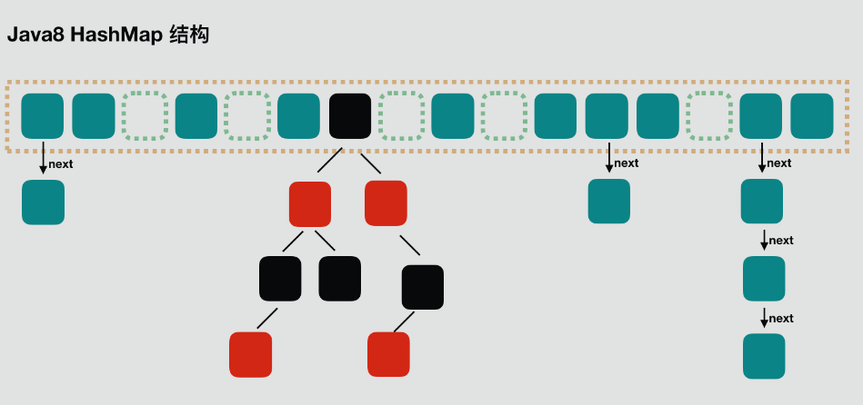
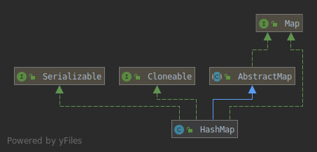

#### 一、数据结构


从上图中可以很清楚的看到，HashMap的数据结构是数组+链表+红黑树（红黑树since JDK1.8）。我们常把数组中的每一个节点称为一个桶。当向桶中添加一个键值对时，首先计算键值对中key的hash值，以此确定插入数组中的位置，但是可能存在同一hash值的元素已经被放在数组同一位置了，这种现象称为碰撞，这时按照尾插法(jdk1.7及以前为头插法)的方式添加key-value到同一hash值的元素的后面，链表就这样形成了。当链表长度超过8(TREEIFY_THRESHOLD)时，链表就转换为红黑树。
- 底层：HashMap是Map接口基于哈希表的实现
- 是否允许null：HashMap允许key和value为null。
- 是否有序：HashMap不保证映射的顺序，特别是它不保证该顺序恒久不变。
- 何时rehash:超过initial capacity*load factor时，且扩容后容量是initial capacity*2
- 初始化容量对性能的影响：太大浪费空间，太小频繁rehash影响性能
- 加载因子对性能影响：小了会频繁rehash，大了增大时间开销
- 是否同步：否
- 迭代器：fast-fail

#### 二、类结构

- extends AbstractMap:继承abstract class AbstractMap
- implemenets Map:实现接口map
- implemenets Cloneable：可调用clone()方法来返回field-for-field拷贝
- implemenets Serializable:表明hashmap可序列化

#### 三、静态全局变量
```java
/**
     *  默认初始化容量，值为16,必须是2的n次幂.
     */
    static final int DEFAULT_INITIAL_CAPACITY = 1 << 4; // aka 16

    /**
     * 最大容量, 容量不能超出这个值。如果一个更大的初始化容量在构造函数中被指定，将被MAXIMUM_CAPACITY替换.
     * 必须是2的倍数。最大容量为1<<30，即2的30次方。
     */
    static final int MAXIMUM_CAPACITY = 1 << 30;

    /**
     * 默认的加载因子。
     */
    static final float DEFAULT_LOAD_FACTOR = 0.75f;

    /**
     * 将链表转化为红黑树的临界值。
     * 当添加一个元素被添加到有至少TREEIFY_THRESHOLD个节点的桶中，桶中链表将被转化为树形结构。
     * 临界值最小为8
     */
    static final int TREEIFY_THRESHOLD = 8;

    /**
     * 恢复成链式结构的桶大小临界值
     * 小于TREEIFY_THRESHOLD，临界值最大为6
     */
    static final int UNTREEIFY_THRESHOLD = 6;

    /**
     * 桶可能被转化为树形结构的最小容量。当哈希表的大小超过这个阈值，才会把链式结构转化成树型结构，否则仅采取扩容来尝试减少冲突。
     * 应该至少4*TREEIFY_THRESHOLD来避免扩容和树形结构化之间的冲突。
     */
    static final int MIN_TREEIFY_CAPACITY = 64;
```
#### 四、静态类部类Node
```java
static class Node<K,V> implements Map.Entry<K,V> {
        //key的hash值
        final int hash;
        final K key;
        V value;
        //指向下一节点引用
        Node<K,V> next;
        //构造涵数
        Node(int hash, K key, V value, Node<K,V> next) {
            this.hash = hash;
            this.key = key;
            this.value = value;
            this.next = next;
        }

        public final K getKey()        { return key; }
        public final V getValue()      { return value; }
        public final String toString() { return key + "=" + value; }

        public final int hashCode() {
            return Objects.hashCode(key) ^ Objects.hashCode(value);
        }

        public final V setValue(V newValue) {
            V oldValue = value;
            value = newValue;
            return oldValue;
        }

        public final boolean equals(Object o) {
            if (o == this)
                return true;
            if (o instanceof Map.Entry) {
                Map.Entry<?,?> e = (Map.Entry<?,?>)o;
                if (Objects.equals(key, e.getKey()) &&
                    Objects.equals(value, e.getValue()))
                    return true;
            }
            return false;
        }
    }
```
#### 五、核心方法
##### 5.1 get(Object key)
```java
public V get(Object key) {
    Node<K,V> e;
    /*
     * 如果通过key获取到的node为null，则返回null，否则返回node的value
     * 1、通过hash(key)方法计算key的哈希值hash;
     * 2、通过getNode(hash,key)方法获取node;
     * 3、如果node为null，返回null，否则返回node.value
     */
    return (e = getNode(hash(key), key)) == null ? null : e.value;
}
```
##### 5.2 hash(Object key)
```java
static final int hash(Object key) {
    int h;
    /*
     * 1、计算key的hashCode;
     * 2、key的hashCode高16位和自已的低16位做异或运算，增加随机性，减少hash冲突
     */
    return (key == null) ? 0 : (h = key.hashCode()) ^ (h >>> 16);
}
```
##### 5.3 getNode( int hash, Object key)
```java
final Node<K,V> getNode(int hash, Object key) {
        Node<K,V>[] tab; Node<K,V> first, e; int n; K k;
        //如果哈希表不为空，而且key对应的桶上不为空
        if ((tab = table) != null && (n = tab.length) > 0 &&
            (first = tab[(n - 1) & hash]) != null) {
            //如果桶中的第一个节点就和hash和key匹配上
            if (first.hash == hash && // always check first node
                ((k = first.key) == key || (key != null && key.equals(k))))
                //返回桶中的第一个节点
                return first;
            //如果第一个节点没匹配上，而且有后续节点
            if ((e = first.next) != null) {
                //如果当前的桶采用的红黑树，则调用红黑树的get的方法去获取节点
                if (first instanceof TreeNode)
                    return ((TreeNode<K,V>)first).getTreeNode(hash, key);
                //如果当前的桶不采用红黑树，即桶中节点结构为链式结构
                do {
                    //遍历链表，直到key匹配
                    if (e.hash == hash &&
                        ((k = e.key) == key || (key != null && key.equals(k))))
                        return e;
                } while ((e = e.next) != null);
            }
        }
        return null;
    }
```
##### 5.4 put( K key, V value)
```java
public V put(K key, V value) {
    /*
     * 1、通过hash(key)计算key的哈希值；
     * 2、调用putVal
     */
    return putVal(hash(key), key, value, false, true);
}
```
##### 5.5 putVal(int hash, K key, V value, boolean onlyIfAbsent,boolean evict)
putVal方法可以分为下面的几个步骤：
- 1、如果哈希表为空，调用resize()创建一个哈希表。
- 2、如果指定参数hash在表中没有对应的桶，即为没有碰撞，直接将键值对插入到哈希表中即可。
- 3、如果有碰撞，遍历桶，找到key映射的节点
  - 3.1 桶中的第一个节点就匹配了，将桶中的第一个节点记录起来。
  - 3.2 如果桶中的第一个节点没有匹配，且桶中结构为红黑树，则调用红黑树对应的方法插入键值对。
  - 3.3 如果不是红黑树，那么就肯定是链表。遍历链表，如果找到了key映射的节点，就记录这个节点，退出循环。如果没有找到，在链表尾部插入节点。插入后，如果链的长度大于TREEIFY_THRESHOLD这个临界值，则使用treeifyBin方法把链表转为红黑树。
- 4、如果找到了key映射的节点，且节点不为null
  - 4.1 记录节点的vlaue。
  - 4.2 如果参数onlyIfAbsent为false，或者oldValue为null，替换value，否则不替换。
  - 4.3 返回记录下来的节点的value。
- 5、如果没有找到key映射的节点（2、3步中讲了，这种情况会插入到hashMap中），插入节点后size会加1，这时要检查size是否大于临界值threshold，如果大于会使用resize方法进行扩容。
```java
/**
  * Implements Map.put and related methods.
  *
  * @param hash 指定参数key的哈希值
  * @param key 指定参数key
  * @param value 指定参数value
  * @param onlyIfAbsent 如果为true，即使指定参数key在map中已经存在，也不会替换value
  * @param evict 如果为false，数组table在创建模式中
  * @return 如果value被替换，则返回旧的value，否则返回null。当然，可能key对应的value就是null。
  */
 final V putVal(int hash, K key, V value, boolean onlyIfAbsent,
                boolean evict) {
     Node<K,V>[] tab; Node<K,V> p; int n, i;
     //如果哈希表为空，调用resize()创建一个哈希表，并用变量n记录哈希表长度
     if ((tab = table) == null || (n = tab.length) == 0)
         n = (tab = resize()).length;
     //如果指定参数hash在表中没有对应的桶，即为没有碰撞
     if ((p = tab[i = (n - 1) & hash]) == null)
         //直接将键值对插入到map中即可
         tab[i] = newNode(hash, key, value, null);
     else {
         Node<K,V> e; K k;
         //如果碰撞了，且桶中的第一个节点就匹配了
         if (p.hash == hash &&
             ((k = p.key) == key || (key != null && key.equals(k))))
             //将桶中的第一个节点记录起来
             e = p;
         //如果桶中的第一个节点没有匹配上，且桶内为红黑树结构，则调用红黑树对应的方法插入键值对
         else if (p instanceof TreeNode)
             e = ((TreeNode<K,V>)p).putTreeVal(this, tab, hash, key, value);
         //不是红黑树结构，那么就肯定是链式结构
         else {
             //遍历链式结构
             for (int binCount = 0; ; ++binCount) {
                 //如果到了链表尾部
                 if ((e = p.next) == null) {
                     //在链表尾部插入键值对
                     p.next = newNode(hash, key, value, null);
                     //如果链的长度大于TREEIFY_THRESHOLD这个临界值，则把链变为红黑树
                     if (binCount >= TREEIFY_THRESHOLD - 1) // -1 for 1st
                         treeifyBin(tab, hash);
                     break;
                 }
                 if (e.hash == hash &&
                     ((k = e.key) == key || (key != null && key.equals(k))))
                     break;
                 //用于遍历桶中的链表，与前面的e = p.next组合，可以遍历链表
                 p = e;
             }
         }
         if (e != null) { // existing mapping for key
             V oldValue = e.value;
             if (!onlyIfAbsent || oldValue == null)
                 e.value = value;
             afterNodeAccess(e);
             return oldValue;
         }
     }
     ++modCount;
     if (++size > threshold)
         resize();
     afterNodeInsertion(evict);
     return null;
 }
```
##### 5.6 resize()
- 1、计算扩容后的容量，临界值；
- 2、将hashMap的临界值修改为扩容后的临界值；
- 3、根据扩容后的容量新建数组，然后将hashMap的table的引用指向新数组；
- 4、将旧数组的元素复制到table中
```java
/**
     * 对table进行初始化或者扩容。
     * 如果table为null，则对table进行初始化
     * 如果对table扩容，因为每次扩容都是翻倍，与原来计算（n-1）&hash的结果相比，节点要么就在原来的位置，要么就被分配到“原位置+旧容量”这个位置。
     */
    final Node<K,V>[] resize() {
        //新建oldTab数组保存扩容前的数组table
        Node<K,V>[] oldTab = table;
        //使用变量oldCap扩容前table的容量
        int oldCap = (oldTab == null) ? 0 : oldTab.length;
        //保存扩容前的临界值
        int oldThr = threshold;
        int newCap, newThr = 0;
        //如果扩容前的容量 > 0
        if (oldCap > 0) {
            //如果当前容量>=MAXIMUM_CAPACITY
            if (oldCap >= MAXIMUM_CAPACITY) {
                //扩容临界值提高到正无穷
                threshold = Integer.MAX_VALUE;
                //无法进行扩容，返回原来的数组
                return oldTab;
            }
            //如果现在容量的两倍小于MAXIMUM_CAPACITY且现在的容量大于DEFAULT_INITIAL_CAPACITY
            else if ((newCap = oldCap << 1) < MAXIMUM_CAPACITY &&
                     oldCap >= DEFAULT_INITIAL_CAPACITY)
                //临界值变为原来的2倍
                newThr = oldThr << 1; // double threshold
        }
        else if (oldThr > 0) //如果旧容量 <= 0，而且旧临界值 > 0
            //数组的新容量设置为老数组扩容的临界值
            newCap = oldThr;
        else { //如果旧容量 <= 0，且旧临界值 <= 0，新容量扩充为默认初始化容量，新临界值为DEFAULT_LOAD_FACTOR * DEFAULT_INITIAL_CAPACITY
            newCap = DEFAULT_INITIAL_CAPACITY;
            newThr = (int)(DEFAULT_LOAD_FACTOR * DEFAULT_INITIAL_CAPACITY);
        }
        if (newThr == 0) {
            float ft = (float)newCap * loadFactor;
            newThr = (newCap < MAXIMUM_CAPACITY && ft < (float)MAXIMUM_CAPACITY ?
                      (int)ft : Integer.MAX_VALUE);
        }
        threshold = newThr;
        @SuppressWarnings({"rawtypes","unchecked"})
        Node<K,V>[] newTab = (Node<K,V>[])new Node[newCap];
        table = newTab;
        //如果旧table不为空，将旧table中的元素复制到新的table中
        if (oldTab != null) {
            for (int j = 0; j < oldCap; ++j) {
                Node<K,V> e;
                if ((e = oldTab[j]) != null) {
                    oldTab[j] = null;
                    if (e.next == null)
                        newTab[e.hash & (newCap - 1)] = e;
                    else if (e instanceof TreeNode)
                        ((TreeNode<K,V>)e).split(this, newTab, j, oldCap);
                    else { // preserve order
                        Node<K,V> loHead = null, loTail = null;
                        Node<K,V> hiHead = null, hiTail = null;
                        Node<K,V> next;
                        do {
                            next = e.next;
                            if ((e.hash & oldCap) == 0) {
                                if (loTail == null)
                                    loHead = e;
                                else
                                    loTail.next = e;
                                loTail = e;
                            }
                            else {
                                if (hiTail == null)
                                    hiHead = e;
                                else
                                    hiTail.next = e;
                                hiTail = e;
                            }
                        } while ((e = next) != null);
                        if (loTail != null) {
                            loTail.next = null;
                            newTab[j] = loHead;
                        }
                        if (hiTail != null) {
                            hiTail.next = null;
                            newTab[j + oldCap] = hiHead;
                        }
                    }
                }
            }
        }
        return newTab;
    }
```
##### 5.7 remove(Object key)
- 1、通过hash(Object key)方法计算key的哈希值;
- 2、通过removeNode方法实现功能;
- 3、返回被删除的node的value
```java
public V remove(Object key) {
    Node<K,V> e;
    //根据key来删除node
    return (e = removeNode(hash(key), key, null, false, true)) == null ?
        null : e.value;
}
```
##### 5.8 removeNode(int hash, Object key, Object value,boolean matchValue, boolean movable)
- 1、如果数组table为空或key映射到的桶为空，返回null。
- 2、如果key映射到的桶上第一个node的就是要删除的node，记录下来。
- 3、如果桶内不止一个node，且桶内的结构为红黑树，记录key映射到的node。
- 4、桶内的结构不为红黑树，那么桶内的结构就肯定为链表，遍历链表，找到key映射到的node，记录下来。
- 5、如果被记录下来的node不为null，删除node，size-1被删除。
- 6、返回被删除的node
```java
/**
     * Implements Map.remove and related methods.
     *
     * @param hash key的哈希值
     * @param key 参数key
     * @param value 如果matchValue为true，则value也作为确定被删除的node的条件之一，否则忽略
     * @param matchValue 如果为true，则value也作为确定被删除的node的条件之一
     * @param movable 如果为false，删除node时不会删除其他node
     * @return 返回被删除的node，如果没有node被删除，则返回null（针对红黑树的删除方法）
     */
    final Node<K,V> removeNode(int hash, Object key, Object value,
                               boolean matchValue, boolean movable) {
        Node<K,V>[] tab; Node<K,V> p; int n, index;
        //如果数组table不为空且key映射到的桶不为空
        if ((tab = table) != null && (n = tab.length) > 0 &&
            (p = tab[index = (n - 1) & hash]) != null) {
            Node<K,V> node = null, e; K k; V v;
            //如果桶上第一个node的就是要删除的node
            if (p.hash == hash &&
                ((k = p.key) == key || (key != null && key.equals(k))))
                //记录桶上第一个node
                node = p;
            else if ((e = p.next) != null) {
                //如果桶内的结构为红黑树
                if (p instanceof TreeNode)
                    //记录key映射到的node
                    node = ((TreeNode<K,V>)p).getTreeNode(hash, key);
                else {//如果桶内的结构为链表
                    do {//遍历链表，找到key映射到的node
                        if (e.hash == hash &&
                            ((k = e.key) == key ||
                             (key != null && key.equals(k)))) {
                            //记录key映射到的node
                            node = e;
                            break;
                        }
                        p = e;
                    } while ((e = e.next) != null);
                }
            }
            if (node != null && (!matchValue || (v = node.value) == value ||
                                 (value != null && value.equals(v)))) {
                if (node instanceof TreeNode)
                    ((TreeNode<K,V>)node).removeTreeNode(this, tab, movable);
                else if (node == p)
                    tab[index] = node.next;
                else
                    p.next = node.next;
                ++modCount;
                --size;
                afterNodeRemoval(node);
                return node;
            }
        }
        return null;
    }
```
