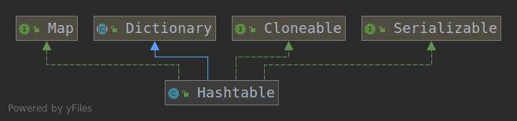

#### 一、类结构


从上图可以看出：
- extends Dictionary:Dictionary 类是一个抽象类，用来存储键/值对，作用和Map类相似
- implements Map<K,V>：实现了Map，实现了Map中声明的操作和default方法
- implements Cloneable：表明其可以调用clone()方法来返回实例的field-for-field拷贝
- implements java.io.Serializable：表明该类是可以序列化的
#### 二、重要全局变量
```java
    private transient Entry<?,?>[] table;

    /**
     * entry的个数
     */
    private transient int count;

    /**
     * hashtable进行扩容的临界值（这个值等于(int)(capacity * loadFactor)）
     */
    private int threshold;

    /**
     * 负载因子
     */
    private float loadFactor;

    /**
     * hashtable被结构型修改的次数
     */
    private transient int modCount = 0;
```
#### 三、构造函数
```java
   /**
     * 使用指定参数初始化容量和默认负载因子（0.75）来构造一个空的hashtable.
     * @param     initialCapacity   指定参数初始化容量
     * @exception IllegalArgumentException 如果initialCapacity小于0
     */
    public Hashtable(int initialCapacity) {
        this(initialCapacity, 0.75f);
    }

    /**
     *  使用默认初始化容量（11）和默认负载因子（0.75）来构造一个空的hashtable.
     *  这里可以看到，Hashtable默认初始化容量为16，而HashMap的默认初始化容量为11
     */
    public Hashtable() {
        this(11, 0.75f);
    }

    /**
     * 使用指定的键值对集合t来构造hashtable。
     *  @param t 指定的键值对集合
     *  @throws NullPointerException 如果指定的键值对集合为null
     */
    public Hashtable(Map<? extends K, ? extends V> t) {
        this(Math.max(2*t.size(), 11), 0.75f);
        putAll(t);
    }
```
#### 四、核心方法
####＃ 4.1 put
- 1、确认value不为null。如果为null，则抛出异常
- 2、找到key在table中的索引，获取key所在位置的entry
- 3、遍历entry，判断key是否已经存在
- 4、如果key已经存在，替换value，返回旧的value
- 5、如果key在hashtable不是已经存在，就直接添加，否则直接将键值对添加到table中，返回null
在方法中可以看到，在遍历桶中元素时，是按照链表的方式遍历的。可以印证，HashMap的桶中可能为链表或者树。但Hashtable的桶中只可能是链表。
```java
     /**
     * 添加指定键值对到hashtable中
     * 被添加的键值对中的key和value都不能为null
     *
     * value可以通过get方法被取出。
     *
     * @param      key     the hashtable key
     * @param      value   the value
     * @return     如果hashtable中已经存在key，则返回原来的value
     * @exception  NullPointerException  如果key或者value为null
     * @see     Object#equals(Object)
     * @see     #get(Object)
     */
    public synchronized V put(K key, V value) {
        // Make sure the value is not null
        if (value == null) {
            throw new NullPointerException();
        }

        // Makes sure the key is not already in the hashtable.
        Entry<?,?> tab[] = table;
        int hash = key.hashCode();
        //找到key在table中的索引
        int index = (hash & 0x7FFFFFFF) % tab.length;
        @SuppressWarnings("unchecked")
        //获取key所在索引的entry
        Entry<K,V> entry = (Entry<K,V>)tab[index];
        //遍历entry，判断key是否已经存在
        for(; entry != null ; entry = entry.next) {
            //如果key已经存在
            if ((entry.hash == hash) && entry.key.equals(key)) {
                //保存旧的value
                V old = entry.value;
                //替换value
                entry.value = value;
                //返回旧的value
                return old;
            }
        }
        //如果key在hashtable不是已经存在，就直接将键值对添加到table中，返回null
        addEntry(hash, key, value, index);
        return null;
    }
```
####＃ 4.2 addEntry
```java
   /**
     * 根据指参数向table中添加entry
     */
    private void addEntry(int hash, K key, V value, int index) {
        //结构性修改次数+1
        modCount++;
        //记录现在的table
        Entry<?,?> tab[] = table;
        //如果现在的entry数量大于临界值
        if (count >= threshold) {
            // 扩容
            rehash();
            //记录新的table
            tab = table;
            //重新计算key的hash
            hash = key.hashCode();
            //重新计算index
            index = (hash & 0x7FFFFFFF) % tab.length;
        }

        // 创建一个新的entry
        @SuppressWarnings("unchecked")
        Entry<K,V> e = (Entry<K,V>) tab[index];
        //将entry添加到table中
        tab[index] = new Entry<>(hash, key, value, e);
        //table大小+1
        count++;
    }
```
####＃ 4.3 rehash
- 1、新建变量新的容量，值为旧的容量的2倍+1
- 2、如果新的容量大于容量的最大值MAX_ARRAY_SIZE 
  - 2.1 如果旧容量为MAX_ARRAY_SIZE，容量不变，中断方法的执行
  - 2.2 如果旧容量不为MAX_ARRAY_SIZE，新容量变为MAX_ARRAY_SIZE
- 3、创建新的数组，容量为新容量
- 4、将旧的数组中的键值对转移到新数组中
这里可以看到，一般情况下，HashMap扩容后容量变为原来的两倍，而Hashtable扩容后容量变为原来的两倍+1
```java
    /**
     * 增加hashtable的容量，为了更有效地存放和找到它的entry。
     * 当键值对的数量超过了临界值（capacity*load factor）这个方法自动调用
     * 长度变为原来的2倍+1
     */
    @SuppressWarnings("unchecked")
    protected void rehash() {
        //记录原容量
        int oldCapacity = table.length;
        Entry<?,?>[] oldMap = table;

        // 新的容量为旧的容量的2倍+1
        int newCapacity = (oldCapacity << 1) + 1;
        //如果新的容量大于容量的最大值MAX_ARRAY_SIZE
        if (newCapacity - MAX_ARRAY_SIZE > 0) {
            //如果旧容量为MAX_ARRAY_SIZE，容量不变，中断方法的执行
            if (oldCapacity == MAX_ARRAY_SIZE)
                // Keep running with MAX_ARRAY_SIZE buckets
                return;
            //如果旧容量不为MAX_ARRAY_SIZE，新容量变为MAX_ARRAY_SIZE
            newCapacity = MAX_ARRAY_SIZE;
        }
        //创建新的数组，容量为新容量
        Entry<?,?>[] newMap = new Entry<?,?>[newCapacity];
        //结构性修改次数+1
        modCount++;
        //计算扩容的临界值
        threshold = (int)Math.min(newCapacity * loadFactor, MAX_ARRAY_SIZE + 1);
        table = newMap;

        for (int i = oldCapacity ; i-- > 0 ;) {
            for (Entry<K,V> old = (Entry<K,V>)oldMap[i] ; old != null ; ) {
                Entry<K,V> e = old;
                old = old.next;

                int index = (e.hash & 0x7FFFFFFF) % newCapacity;
                e.next = (Entry<K,V>)newMap[index];
                newMap[index] = e;
            }
        }
    }
```
#### 4.4 remove
- 1、找到key在table中的索引，获取key所在位置的entry
- 2、遍历entry，判断key是否已经存在
- 3、如果key存在，删除key映射的键值对，返回旧的value
- 4、如果key在hashtable不存在，返回null
```java
    /**
     * 删除hashtable中参数key映射的键值对。如果参数key在hashtable不存在，方法不做任何操作。
     *
     * @param   key   参数key
     * @return  参数key映射的value，如果不存在对应的映射，返回null。
     * @throws  NullPointerException  如果key为null
     */
    public synchronized V remove(Object key) {
        Entry<?,?> tab[] = table;
        int hash = key.hashCode();
        //计算key在hashtable中的索引
        int index = (hash & 0x7FFFFFFF) % tab.length;
        @SuppressWarnings("unchecked")
        Entry<K,V> e = (Entry<K,V>)tab[index];
        //遍历entry，如果entry中存在key为参数key的键值对，就删除键值对，并返回键值对的value
        for(Entry<K,V> prev = null ; e != null ; prev = e, e = e.next) {
            if ((e.hash == hash) && e.key.equals(key)) {
                modCount++;
                if (prev != null) {
                    prev.next = e.next;
                } else {
                    tab[index] = e.next;
                }
                count--;
                V oldValue = e.value;
                e.value = null;
                return oldValue;
            }
        }
        //如果不存在key为参数key的键值对，返回value
        return null;
    }
```
